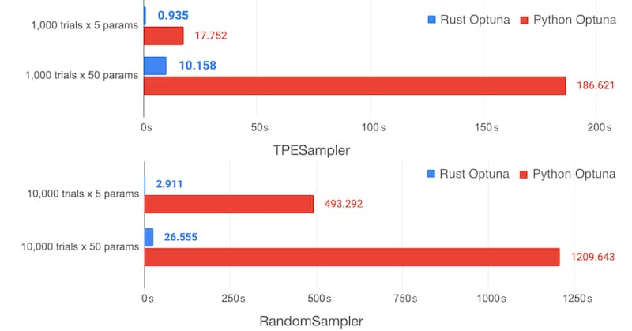

# Rustuna

Rustuna is a faster Optuna implementation in Rust, featuring Python and JavaScript bindings.

!!! note
    Rustuna is currently experimental. Compared with Optuna, it still lacks some features and APIs, and it has not yet been optimized enough to deliver better performance for every use case. Since the project has not had the same level of maturity as Optuna, bugs and rough edges likely remain. We appreciate your understanding when using it.

    If you are excited to try new software, we would love for you to give Rustuna a try and share your feedback with us.

## Why Rustuna?

The Optuna implementation in Rust is primarily motivated by two factors.

### Making Optuna Faster

{ width="1200" }

Optuna primarily targets hyperparameter optimization in machine learning. In such scenarios, model training and evaluation are typically time-consuming processes, so Optuna’s execution time seldom becomes the bottleneck.
However, black-box optimization has potential applications far beyond machine learning hyperparameter tuning. Rustuna is designed with such broader use cases in mind, including large-scale optimization workloads that may involve tens of thousands of trials or more.

### Broadening Language Support

The Rust-based implementation can be used not only from Rust and Python, but also through JavaScript bindings, which are used in the development of [Optuna Dashboard](https://github.com/optuna/optuna-dashboard).
Looking ahead, we are also interested in exploring support for additional languages.

## Design Philosophy

### Balancing Compatibility with Optuna and Performance

Rustuna provides essentially the same API as Optuna.
Users do not need to learn a new API, and they can transition straightforwardly from existing projects while continuing to benefit from the ecosystem that Optuna has built.
For example, the following code works as is by simply changing the import statement.

```python
import rustuna as optuna

def objective(trial: optuna.Trial) -> float:
    x = trial.suggest_float("x", -10, 10)
    y = trial.suggest_float("y", -10, 10)
    value = (x - 2) ** 2 + (y + 5) ** 2
    return value

study = optuna.create_study()
study.optimize(objective, n_trials=1000)
print(study.best_trial)
```

That said, Rustuna does not maintain this level of compatibility in every case.
Prioritizing compatibility too heavily would limit the performance improvements Rustuna can achieve.
For example, some features, such as `study.enqueue_trial()`, are implemented differently from Optuna’s and therefore cannot always be used in exactly the same way.
This is why we say that Rustuna provides “essentially” the same API as Optuna.

### Not Aiming to Completely Replace Optuna

Rustuna is not intended to serve as a complete replacement for Optuna.
Instead of re-engineering all of Optuna’s features in Rust, we aim to build a library that works alongside Optuna so that the strengths of each can complement one another.

For example, the [optuna.visualization module](https://optuna.readthedocs.io/en/stable/reference/visualization/index.html) provides rich functionality for visualizing and analyzing Optuna study results.
We do not plan to reimplement these features in Rust using libraries such as Plotly or Matplotlib. Instead, we aim to provide ways to use Rustuna’s results with the `optuna.visualization` module or with [Optuna Dashboard](https://github.com/optuna/optuna-dashboard).


## What's Next?

Ready to try Rustuna in practice? The best place to start is the [Getting Started](tutorial/getting-started.md) guide, which walks through the basic functionality and core APIs.

## Contributing Guidelines

Any contributions to Rustuna are welcome!
If you are interested in contributing, please take a look at [our contribution guidelines](https://github.com/optuna/rustuna/blob/main/CONTRIBUTING.md).

## License

MIT License
